# python_lab
# lab3
## Задание1
### text.py
```python
import re
from enum import unique


def normalize(text: str, *, casefold: bool = True, yo2e: bool = True) -> str:
    if casefold:
        text = text.casefold()
    if yo2e:
        text = text.replace('ё', 'е')
        text = text.replace('Ё', 'Е')
        text = text.replace('\n', ' ').replace('\r', ' ').replace('\t', ' ')
    while '   ' in text:
        text = text.replace('   ', ' ')
    return text.strip()


def tokenize(text: str) -> list[str]:
    text = text.replace('!', '')
    text = re.split(r'[^\w-]+', text)
    return text


def count_freq(tokens: list[str]) -> dict[str, int]:
    dic = {}
    unique = set(tokens)
    for _ in unique:
        dic[_] = tokens.count(_)
    return dict(sorted(dic.items(), key=lambda x: (-x[1], x[0])))


def top_n(freq: dict[str, int], n: int = 5) -> list[tuple[str, int]]:
    return sorted(freq.items(), key=lambda x: x[1], reverse=True)[:n]


print('----------normalize----------')
print(normalize("ПрИвЕт\nМИр\t"))
print(normalize("ёжик, Ёлка"))
print(normalize("Hello\r\nWorld"))
print(normalize("  двойные   пробелы  "))
print('----------tokenize----------')
print(tokenize("привет мир"))
print(tokenize("hello,world!!!"))
print(tokenize("по-настоящему круто"))
print(tokenize("2025 год"))
print(tokenize("emoji 😀 не слово"))
print('----------count_freq + top_n----------')
print(count_freq(["a","b","a","c","b","a"]))
print(count_freq(["bb","aa","bb","aa","cc"]))
print(top_n({"a":3,"b":2,"c":1}, n=2))
print(top_n({"aa":2,"bb":2,"cc":1}, n=2))
```
## Задание2
### text_stats.py
```python
import sys
import os

sys.path.append('/Users\dimas\OneDrive\Рабочий стол\python_lab-1\src\lib') 
from text import *

text = input()
tokens = []
def main():
    if not text:
        print("Ввод не предоставлен")
        return
    normalized_text = normalize(text)

for word in normalize(text).split():
    clean_word = word.strip('.,!!!!?;:"()[]{}')
    if clean_word:
        tokens.append(clean_word)

total_words = len(tokens)
freq_dict = count_freq(tokens)
unique_words = len(freq_dict)
top_words = top_n(freq_dict, 5)
print(f"Всего слов: {total_words}")
print(f"Уникальных слов: {unique_words}")
print("Топ-5:")
for word, count in top_words:
        print(f"{word}:{count}")

main()
```
# lab2
### Задание1
### 1 arrays.py (min_max)
```python
def min_max(mns_mxs):
    if len(mns_mxs) != 0:
        return print (tuple([min(mns_mxs), max(mns_mxs)]))
    else:
        raise ValueError
min_max([3, -1, 5, 5, 0])
min_max([42])
min_max([-5, -2, -9])
min_max([])
min_max([1.5, 2, 2.0, -3.1])
```
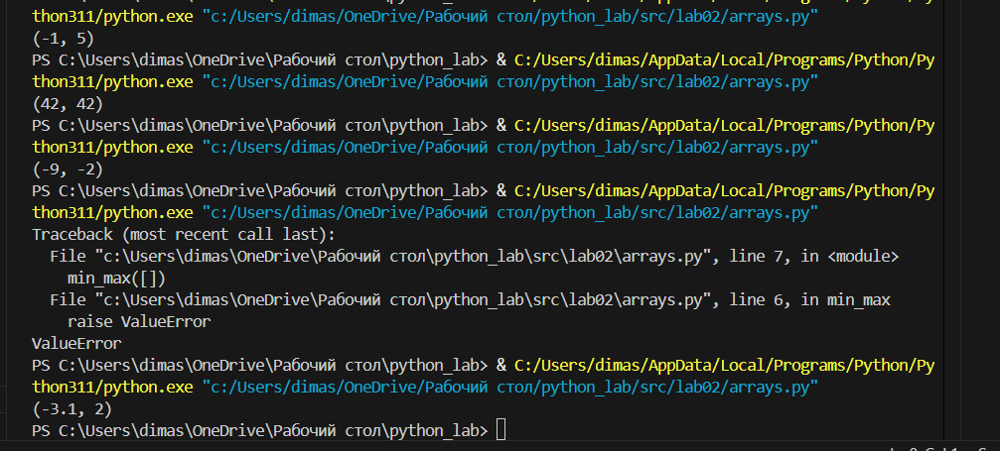
### 2 arrays.py (unique_sorted)
```python
def unique_sorted(elements):
    elements = list(set(sorted(elements)))
    elements.sort(reverse=False)
    return elements
print(unique_sorted([3, 1, 2, 1, 3]))
print(unique_sorted([]))
print(unique_sorted([-1, -1, 0, 2, 2]))
print(unique_sorted([1.0, 1, 2.5, 2.5, 0]))
```
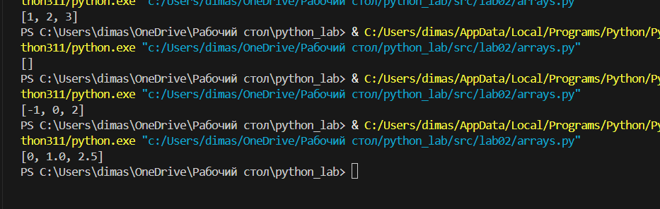
### 3 arrays.py (flatten)
```python
def flatten(flatten_elem):
    result_sort = []
    for i in range(len(flatten_elem)):
        if type(flatten_elem[i]) in [list, tuple]:
            result_sort += list(flatten_elem[i])
        else:
            raise TypeError
    return result_sort
print(flatten([[1, 2], [3, 4]]))
print(flatten([[1, 2], (3, 4, 5)]))
print(flatten([[1], [], [2, 3]]))
print(flatten([[1, 2], "ab"]))
```
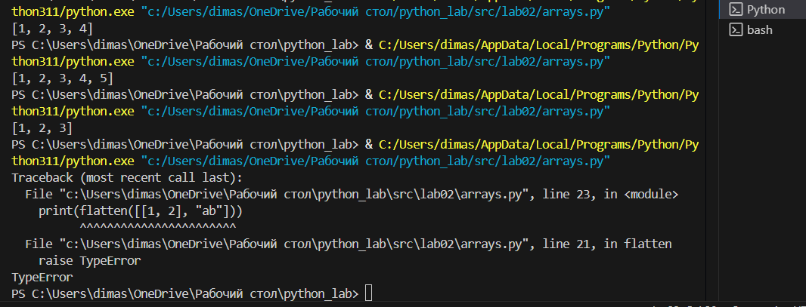
### Задание2
### 1 matrix.py(transpose)
```python
def transpose(matrix):
    if not matrix:
        return []
    
    for el_mat in matrix:
        if len(el_mat)!=len(matrix[0]):
            raise ValueError
        
    result=[]
    for i in range(len(matrix[0])):
        transposes=[]
        for j in range(len(matrix)):
            transposes.append(matrix[j][i])
        result.append(transposes)
    return result
print('transpose')
print(transpose([[1, 2, 3]]))
print(transpose([[1], [2], [3]]))
print(transpose([[1, 2], [3, 4]]))
print(transpose([]))
print(transpose([[1, 2], [3]]))
```
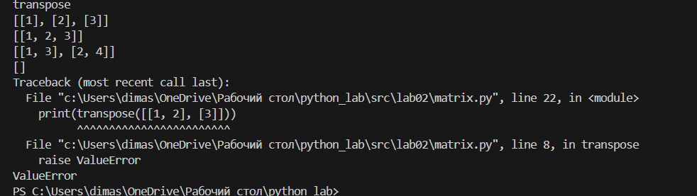
### 2 matrix.py(row_sums)
```python
def row_sums(sum_matrix):
    if not sum_matrix:
        return []
    
    for el_mat in sum_matrix:
        if len(el_mat)!=len(sum_matrix[0]):
            raise ValueError
    
    summa=[]
    for el_mat in sum_matrix:
        el_sum = sum(el_mat)
        summa.append(el_sum)
    return summa
print('row_sums')
print(row_sums([[1, 2, 3], [4, 5, 6]]))
print(row_sums([[-1, 1], [10, -10]]))
print(row_sums([[0, 0], [0, 0]]))
print(row_sums([[1, 2], [3]]))
```
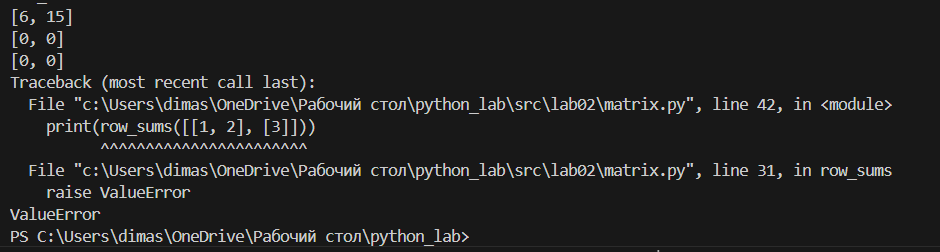
### 3 matrix.py(col_sums)
```python
def col_sums(col_matrix):
    if not col_matrix:
        return []
    
    for el_mat in col_matrix:
        if len(el_mat)!=len(col_matrix[0]):
            raise ValueError
    result=[]
    for i in range(len(col_matrix[0])):
        summ=0
        for j in range(len(col_matrix)):
            summ+=col_matrix[j][i]
        result.append(summ)
    return result
print('col_sums')
print(col_sums([[1, 2, 3], [4, 5, 6]]))
print(col_sums([[-1, 1], [10, -10]]))
print(col_sums([[0, 0], [0, 0]]))
print(col_sums([[1, 2], [3]]))


```
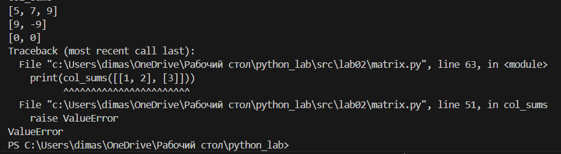
### Задание3
### tuples.py
```python
def format(tuple_inf):
    if len(tuple_inf)!=3:
        raise TypeError
    if type(tuple_inf[2])!=float:
        raise TypeError
    if type(tuple_inf[0])!=str:
        raise TypeError
    if type(tuple_inf[1])!=str:
        raise TypeError
    fio=tuple_inf[0].strip().split()
    gruppa=tuple_inf[1].strip()
    gpa=tuple_inf[2]
    fio_out=fio[0].capitalize()+' '
    if not fio:
        raise ValueError
    if not gruppa:
        raise ValueError
    if gpa<0:
        raise ValueError
    for i in range(1,len(fio)):
        fio_out+=fio[i][0].upper()+'.'
    print(fio_out+','+ f' гр. {tuple_inf[1]}',f'GPA {tuple_inf[2]:.2f}')
format(('Иванов Иван Иванович','BIVT-25',4.6))
format(("Петров Пётр", "IKBO-12", 5.0))
format(("Петров Пётр Петрович", "IKBO-12", 5.0))
format(("  сидорова  анна   сергеевна ", "ABB-01", 3.999))
```
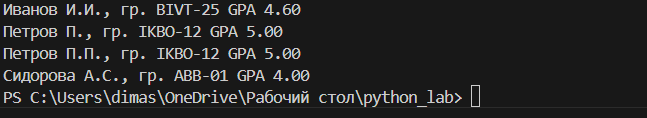


# lab1
### Задание 1
```python
name = input("Имя: ")
age = input("Возраст: ")
print("Првиет, " + name + "!", "Через год тебе будет " + str(int(age)+1) + ".")
```
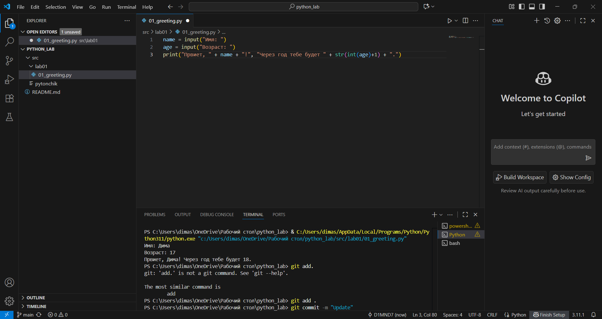


### Задание 2
```python
a = input()
b = float(input())
print("a: " + a.replace('.', ','))
print("b: " + str(b))
print("sum=" + f"{(float(a)+b):.2f}" + ";" + " avg=" + f"{(float(a)+b)/2:.2f}")
```
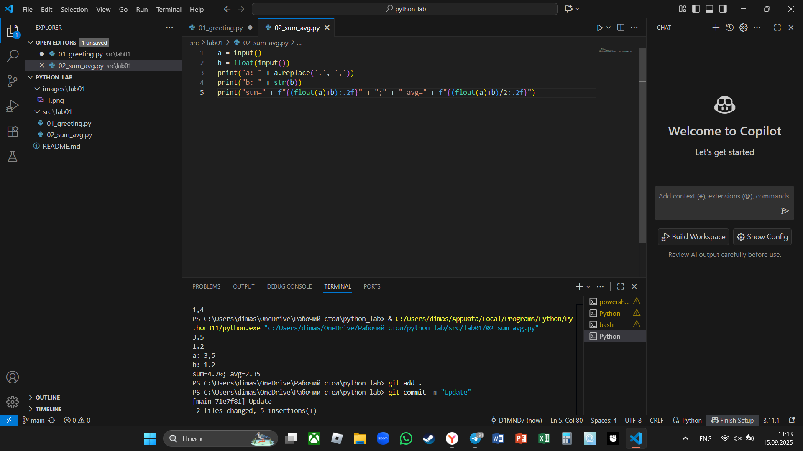

### Задание 3
```python
price=float(input())
discount=float(input())
vat=float(input())
base=price*(1-discount/100)
vat_amount=base*(vat/100)
total=base+vat_amount
print(f'База после скидки:{base:.2f}₽')
print(f'НДС:{vat_amount:.2f}₽')
print(f'Итого к оплате:{total:.2f}₽')
```
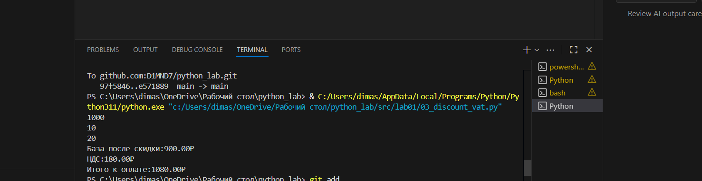

### Задание 4
```python
m = int(input("Минуты: "))
print(str(m//60) + ":" + f"{(m%60):02d}")
```
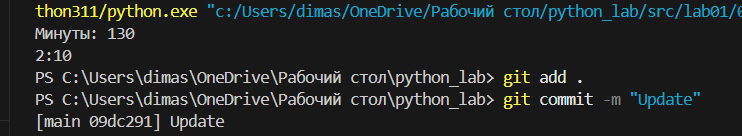

### Задание 5
```python
a, b, c = map(str, input().split())
print("ФИО: ", a, b, c)
print("Инициалы: ", a[0] + b[0] + c[0] + '.')
print("Длина (символов): " + str(len(a) + len(b) + len(c) + 2))
```
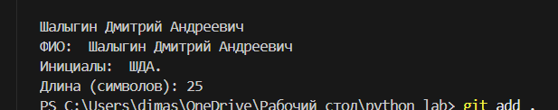
