# python_lab
# lab10
### structures.py
```python
from collections import deque
from typing import Any, Optional

class Stack:
    """Стек на базе списка."""
    
    def __init__(self):
        self._data = []
    
    def push(self, item):
        """Добавить элемент на вершину стека."""
        self._data.append(item)
    
    def pop(self):
        """Удалить и вернуть элемент с вершины стека."""
        if self.is_empty():
            raise IndexError("pop from empty stack")
        return self._data.pop()
    
    def peek(self):
        """Вернуть элемент с вершины без удаления."""
        if self.is_empty():
            return None
        return self._data[-1]
    
    def is_empty(self):
        """Проверить, пуст ли стек."""
        return len(self._data) == 0
    
    def __len__(self):
        """Вернуть количество элементов."""
        return len(self._data)
    
    def __repr__(self):
        """Строковое представление."""
        return f"Stack({self._data})"
class Queue:
    """Реализация очереди на базе deque."""
    
    def __init__(self) -> None:
        self._data: deque[Any] = deque()
    
    def enqueue(self, item: Any) -> None:
        """Добавить элемент в конец очереди."""
        self._data.append(item)
    
    def dequeue(self) -> Any:
        """Удалить и вернуть элемент из начала очереди."""
        if self.is_empty():
            raise IndexError("dequeue from empty queue")
        return self._data.popleft()
    
    def peek(self) -> Optional[Any]:
        """Вернуть элемент из начала без удаления."""
        if self.is_empty():
            return None
        return self._data[0]
    
    def is_empty(self) -> bool:
        """Проверить, пуста ли очередь."""
        return len(self._data) == 0
    
    def __len__(self) -> int:
        """Вернуть количество элементов в очереди."""
        return len(self._data)
    
    def __repr__(self) -> str:
        """Вернуть строковое представление очереди."""
        return f"Queue({list(self._data)})"
```
### linked_list.py
```python
from typing import Any, Optional, Iterator

class Node:
    """Узел односвязного списка."""
    
    def __init__(self, value: Any, next_node: Optional['Node'] = None) -> None:
        self.value: Any = value
        self.next: Optional['Node'] = next_node
    
    def __repr__(self) -> str:
        return f"Node({self.value})"


class SinglyLinkedList:
    """Односвязный список."""
    
    def __init__(self) -> None:
        self.head: Optional[Node] = None
        self.tail: Optional[Node] = None
        self._size: int = 0
    
    def append(self, value: Any) -> None:
        """Добавить элемент в конец списка."""
        new_node = Node(value)
        
        if self.is_empty():
            self.head = new_node
            self.tail = new_node
        else:
            self.tail.next = new_node
            self.tail = new_node
        
        self._size += 1
    
    def prepend(self, value: Any) -> None:
        """Добавить элемент в начало списка."""
        new_node = Node(value, self.head)
        self.head = new_node
        
        if self.tail is None:
            self.tail = new_node
        
        self._size += 1
    
    def insert(self, idx: int, value: Any) -> None:
        """Вставить элемент по индексу."""
        if idx < 0 or idx > self._size:
            raise IndexError(f"Index {idx} out of range [0, {self._size}]")
        
        if idx == 0:
            self.prepend(value)
        elif idx == self._size:
            self.append(value)
        else:
            current = self.head
            for _ in range(idx - 1):
                current = current.next
            
            new_node = Node(value, current.next)
            current.next = new_node
            self._size += 1
    
    def remove_at(self, idx: int) -> None:
        """Удалить элемент по индексу."""
        if idx < 0 or idx >= self._size:
            raise IndexError(f"Index {idx} out of range [0, {self._size})")
        
        if idx == 0:
            self.head = self.head.next
            if self.head is None:
                self.tail = None
        else:
            current = self.head
            for _ in range(idx - 1):
                current = current.next
            
            current.next = current.next.next
            
            if current.next is None:
                self.tail = current
        
        self._size -= 1
    
    def remove(self, value: Any) -> bool:
        """Удалить первое вхождение значения."""
        if self.is_empty():
            return False
        
        if self.head.value == value:
            self.head = self.head.next
            if self.head is None:
                self.tail = None
            self._size -= 1
            return True
        
        current = self.head
        while current.next is not None and current.next.value != value:
            current = current.next
        
        if current.next is None:
            return False
        
        current.next = current.next.next
        if current.next is None:
            self.tail = current
        
        self._size -= 1
        return True
    
    def is_empty(self) -> bool:
        """Проверить, пуст ли список."""
        return self.head is None
    
    def __len__(self) -> int:
        """Вернуть количество элементов."""
        return self._size
    
    def __iter__(self) -> Iterator[Any]:
        """Итератор по значениям списка."""
        current = self.head
        while current is not None:
            yield current.value
            current = current.next
    
    def __repr__(self) -> str:
        """Вернуть строковое представление списка."""
        items = list(self)
        return f"SinglyLinkedList({items})"
    
    def __str__(self) -> str:
        """Вернуть красивое представление списка."""
        result = []
        current = self.head
        while current is not None:
            result.append(str(current.value))
            current = current.next
        return " -> ".join(result) + " -> None"
```

# lab9
### group.py
```python
import csv
from pathlib import Path
from typing import List, Dict, Any
from ..lab08.models import Student


class Group:
    """Класс для управления группой студентов в CSV-хранилище."""
    
    def __init__(self, storage_path: str):
        """
        Инициализация группы.
        
        Args:
            storage_path: путь к CSV-файлу с данными студентов
        """
        self.path = Path(storage_path)
        self._ensure_storage_exists()
    
    def _ensure_storage_exists(self) -> None:
        """
        Создаёт файл с заголовком, если его ещё нет.
        """
        if not self.path.exists():
            self.path.parent.mkdir(parents=True, exist_ok=True)
            with open(self.path, 'w', encoding='utf-8', newline='') as file:
                writer = csv.DictWriter(file, fieldnames=['fio', 'birthdate', 'group', 'gpa'])
                writer.writeheader()
    
    def _read_all(self) -> List[Dict[str, str]]:
        """
        Читает все записи из CSV-файла.
        
        Returns:
            Список словарей с данными студентов
        """
        rows = []
        if not self.path.exists():
            return rows
            
        with open(self.path, 'r', encoding='utf-8') as file:
            reader = csv.DictReader(file)
            for row in reader:
                rows.append(row)
        return rows
    
    def _write_all(self, rows: List[Dict[str, str]]) -> None:
        """
        Записывает все записи в CSV-файл.
        
        Args:
            rows: список словарей с данными студентов
        """
        with open(self.path, 'w', encoding='utf-8', newline='') as file:
            writer = csv.DictWriter(file, fieldnames=['fio', 'birthdate', 'group', 'gpa'])
            writer.writeheader()
            writer.writerows(rows)
    
    def list(self) -> List[Student]:
        """
        Возвращает всех студентов в виде объектов Student.
        
        Returns:
            Список объектов Student
        """
        rows = self._read_all()
        students = []
        
        for row in rows:
            try:
                student = Student(
                    fio=row['fio'],
                    birthdate=row['birthdate'],
                    group=row['group'],
                    gpa=float(row['gpa'])
                )
                students.append(student)
            except Exception as e:
                print(f"Ошибка при чтении студента {row}: {e}")
                continue
        
        return students
    
    def add(self, student: Student) -> bool:
        """
        Добавляет нового студента в CSV.
        
        Args:
            student: объект Student для добавления
            
        Returns:
            True если добавление успешно, False в противном случае
        """
        try:
            rows = self._read_all()
            
            # Проверяем, нет ли уже студента с таким ФИО
            for row in rows:
                if row['fio'] == student.fio:
                    print(f"Студент с ФИО '{student.fio}' уже существует")
                    return False
            
            # Добавляем нового студента
            new_row = {
                'fio': student.fio,
                'birthdate': student.birthdate,
                'group': student.group,
                'gpa': str(student.gpa)
            }
            rows.append(new_row)
            
            self._write_all(rows)
            return True
            
        except Exception as e:
            print(f"Ошибка при добавлении студента: {e}")
            return False
    
    def find(self, substr: str) -> List[Student]:
        """
        Находит студентов по подстроке в ФИО.
        
        Args:
            substr: подстрока для поиска в поле fio
            
        Returns:
            Список объектов Student, содержащих подстроку в ФИО
        """
        all_students = self.list()
        result = []
        
        for student in all_students:
            if substr.lower() in student.fio.lower():
                result.append(student)
        
        return result
    
    def remove(self, fio: str) -> bool:
        """
        Удаляет запись(и) с данным ФИО.
        
        Args:
            fio: ФИО студента для удаления
            
        Returns:
            True если удаление успешно, False в противном случае
        """
        rows = self._read_all()
        initial_length = len(rows)
        
        # Удаляем все записи с заданным ФИО
        rows = [row for row in rows if row['fio'] != fio]
        
        if len(rows) < initial_length:
            self._write_all(rows)
            return True
        
        print(f"Студент с ФИО '{fio}' не найден")
        return False
    
    def update(self, fio: str, **fields) -> bool:
        """
        Обновляет поля существующего студента.
        
        Args:
            fio: ФИО студента для обновления
            **fields: поля для обновления (fio, birthdate, group, gpa)
            
        Returns:
            True если обновление успешно, False в противном случае
        """
        rows = self._read_all()
        updated = False
        
        for row in rows:
            if row['fio'] == fio:
                # Обновляем указанные поля
                for field, value in fields.items():
                    if field == 'gpa':
                        row[field] = str(float(value))
                    else:
                        row[field] = str(value)
                updated = True
                break
        
        if updated:
            self._write_all(rows)
            return True
        
        print(f"Студент с ФИО '{fio}' не найден")
        return False
    
    def stats(self) -> Dict[str, Any]:
        """
        Собирает статистику по группе.
        
        Returns:
            Словарь со статистикой:
            {
                "count": общее количество студентов,
                "min_gpa": минимальный gpa,
                "max_gpa": максимальный gpa,
                "avg_gpa": средний gpa,
                "groups": распределение по группам,
                "top_5_students": топ-5 студентов по gpa
            }
        """
        students = self.list()
        
        if not students:
            return {
                "count": 0,
                "min_gpa": None,
                "max_gpa": None,
                "avg_gpa": None,
                "groups": {},
                "top_5_students": []
            }
        
        # Собираем статистику
        gpa_values = [s.gpa for s in students]
        
        # Распределение по группам
        groups_dict = {}
        for s in students:
            if s.group not in groups_dict:
                groups_dict[s.group] = 0
            groups_dict[s.group] += 1
        
        # Топ-5 студентов по GPA
        sorted_students = sorted(students, key=lambda x: x.gpa, reverse=True)
        top_5 = [
            {"fio": s.fio, "gpa": s.gpa}
            for s in sorted_students[:5]
        ]
        
        return {
            "count": len(students),
            "min_gpa": min(gpa_values),
            "max_gpa": max(gpa_values),
            "avg_gpa": sum(gpa_values) / len(gpa_values),
            "groups": groups_dict,
            "top_5_students": top_5
        }
```
### test_lab9.py
#### запуск/тест
```python
import sys
from pathlib import Path

sys.path.append(str(Path(__file__).parent / 'src'))

from src.lab08.models import Student
from src.lab09 import Group

def main():
    print("=== Тестирование ЛР9 ===")
    
    # Создаем группу
    group = Group("data/lab09/students.csv")
    
    # 1. Чтение существующих
    print("\n1. Существующие студенты:")
    students = group.list()
    for s in students:
        print(f"   {s.fio}, {s.birthdate}, {s.group}, {s.gpa}")
    
    # 2. Добавление нового
    print("\n2. Добавляем нового студента:")
    new_student = Student(
        fio="Новиков Петр Сергеевич",
        birthdate="2003-08-25",
        group="БИВТ-21-3",
        gpa=4.2
    )
    
    if group.add(new_student):
        print("   Добавлен!")
    
    # 3. Поиск
    print("\n3. Поиск 'Иванов':")
    found = group.find("Иванов")
    for s in found:
        print(f"   Найден: {s.fio}")
    
    # 4. Обновление
    print("\n4. Обновляем GPA Иванова:")
    if group.update("Иванов Иван Иванович", gpa=4.8):
        print("   Обновлено!")
    
    # 5. Удаление
    print("\n5. Удаляем Сидорова:")
    if group.remove("Сидоров Алексей Петрович"):
        print("   Удалено!")
    
    # 6. Статистика
    print("\n6. Статистика:")
    stats = group.stats()
    print(f"   Всего студентов: {stats['count']}")
    print(f"   Минимальный GPA: {stats['min_gpa']}")
    print(f"   Максимальный GPA: {stats['max_gpa']}")
    print(f"   Средний GPA: {stats['avg_gpa']:.2f}")
    print(f"   Распределение по группам: {stats['groups']}")
    
    print("   Топ-5 студентов:")
    for i, student in enumerate(stats['top_5_students'], 1):
        print(f"     {i}. {student['fio']} - {student['gpa']}")
    
    # 7. Финальный список
    print("\n7. Финальный список:")
    for s in group.list():
        print(f"   {s.fio}, {s.birthdate}, {s.group}, {s.gpa}")

if __name__ == "__main__":
    main()
```
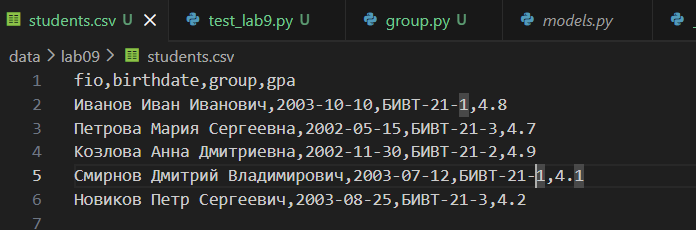
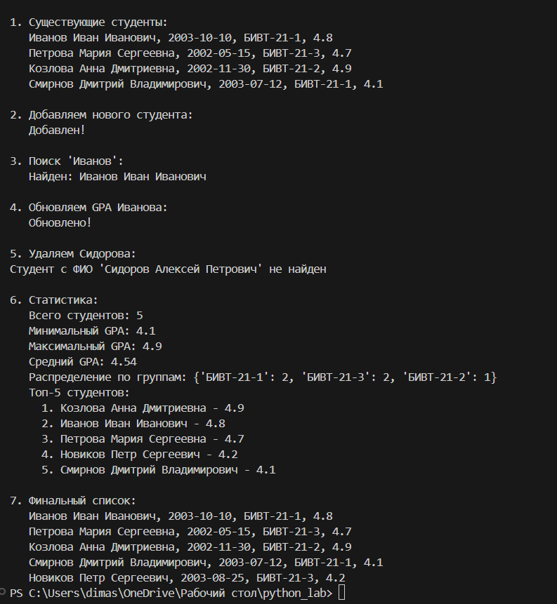
# lab8
### models.py
```python
from dataclasses import dataclass
from datetime import datetime, date
import re


@dataclass
class Student:
    fio: str
    birthdate: str
    group: str
    gpa: float

    def __post_init__(self):
        """Валидация данных после инициализации"""
        # Валидация формата даты
        try:
            datetime.strptime(self.birthdate, "%Y-%m-%d")
        except ValueError:
            raise ValueError("Дата должна быть в формате YYYY-MM-DD")
        
        # Валидация GPA
        if not (0 <= self.gpa <= 5):
            raise ValueError("GPA должен быть в диапазоне от 0 до 5")
        
        # Валидация ФИО (должно содержать только буквы и пробелы)
        if not re.match(r'^[A-Za-zА-Яа-яЁё\s]+$', self.fio):
            raise ValueError("ФИО должно содержать только буквы и пробелы")

    def age(self) -> int:
        """Возвращает количество полных лет студента"""
        birth_date = datetime.strptime(self.birthdate, "%Y-%m-%d").date()
        today = date.today()
        
        age = today.year - birth_date.year
        
        # Проверяем, был ли уже день рождения в этом году
        if today.month < birth_date.month or (today.month == birth_date.month and today.day < birth_date.day):
            age -= 1
            
        return age

    def to_dict(self) -> dict:
        """Сериализация объекта в словарь"""
        return {
            "fio": self.fio,
            "birthdate": self.birthdate,
            "group": self.group,
            "gpa": self.gpa
        }

    @classmethod
    def from_dict(cls, data: dict):
        """Десериализация объекта из словаря"""
        return cls(
            fio=data["fio"],
            birthdate=data["birthdate"],
            group=data["group"],
            gpa=data["gpa"]
        )

    def __str__(self) -> str:
        """Строковое представление объекта"""
        return f"{self.fio}, группа {self.group}, возраст {self.age()}, GPA: {self.gpa}"

    def is_excellent(self) -> bool:
        """Дополнительный метод: проверяет, является ли студент отличником"""
        return self.gpa >= 4.5
```
### serialize.py
```python
import json
from typing import List
from .models import Student


def students_to_json(students: List[Student], path: str) -> None:
    """
    Сохраняет список студентов в JSON файл
    
    Args:
        students: список объектов Student
        path: путь к файлу для сохранения
    """
    data = [student.to_dict() for student in students]
    
    with open(path, 'w', encoding='utf-8') as f:
        json.dump(data, f, ensure_ascii=False, indent=2)


def students_from_json(path: str) -> List[Student]:
    """
    Читает JSON файл и создает список объектов Student
    
    Args:
        path: путь к JSON файлу
        
    Returns:
        List[Student]: список объектов Student
    """
    try:
        with open(path, 'r', encoding='utf-8') as f:
            data = json.load(f)
        
        students = []
        for item in data:
            try:
                student = Student.from_dict(item)
                students.append(student)
            except (ValueError, KeyError) as e:
                print(f"Ошибка при создании студента из данных: {item}. Ошибка: {e}")
                continue
                
        return students
        
    except FileNotFoundError:
        print(f"Файл {path} не найден")
        return []
    except json.JSONDecodeError:
        print(f"Ошибка декодирования JSON в файле {path}")
        return [] 
```
### lab08_demo.py
```python
import sys
import os

# Добавляем путь к src для импорта модулей
sys.path.append(os.path.join(os.path.dirname(__file__), 'src'))

from lab08.models import Student
from lab08.serialize import students_to_json, students_from_json

def main():
    print("=== Лабораторная работа 8 - Демонстрация ===")
    print()
    
    # 1. Демонстрация создания объектов
    print("1. Создание объектов Student:")
    print("-" * 40)
    
    student1 = Student("Иванов Иван Иванович", "2000-05-15", "SE-01", 4.7)
    student2 = Student("Петрова Анна Сергеевна", "2001-08-22", "SE-02", 3.8)
    student3 = Student("Сидоров Алексей Петрович", "1999-12-10", "SE-01", 4.2)
    
    print("Созданные студенты:")
    print(f"  • {student1}")
    print(f"  • {student2}")
    print(f"  • {student3}")
    print()
    
    # 2. Демонстрация методов
    print("2. Демонстрация методов:")
    print("-" * 40)
    
    print(f"Студент {student1.fio.split()[1]} является отличником: {student1.is_excellent()}")
    print(f"Студент {student2.fio.split()[1]} является отличником: {student2.is_excellent()}")
    print()
    
    # 3. Сериализация в JSON
    print("3. Сериализация в JSON:")
    print("-" * 40)
    
    students_list = [student1, student2, student3]
    output_path = "data/lab08/students_output.json"
    
    students_to_json(students_list, output_path)
    print(f" Список студентов сохранен в: {output_path}")
    print()
    
    # 4. Десериализация из JSON
    print("4. Десериализация из JSON:")
    print("-" * 40)
    
    input_path = "data/lab08/students_input.json"
    loaded_students = students_from_json(input_path)
    
    print(f" Загружено студентов из {input_path}: {len(loaded_students)}")
    for i, student in enumerate(loaded_students, 1):
        print(f"  {i}. {student}")
    print()
    
    # 5. Демонстрация обработки ошибок
    print("5. Демонстрация обработки ошибок:")
    print("-" * 40)
    
    print("Попытка создания студента с неправильным GPA (6.0):")
    try:
        bad_student1 = Student("Тестовый Студент", "2000-01-01", "SE-01", 6.0)
    except ValueError as e:
        print(f"   Ошибка: {e}")
    
    print("Попытка создания студента с неправильным форматом даты:")
    try:
        bad_student2 = Student("Тестовый Студент", "2000/01/01", "SE-01", 4.0)
    except ValueError as e:
        print(f"   Ошибка: {e}")
    
    print("Попытка создания студента с неправильным ФИО:")
    try:
        bad_student3 = Student("Студент123", "2000-01-01", "SE-01", 4.0)
    except ValueError as e:
        print(f"   Ошибка: {e}")
    
    print()
    print("=== Демонстрация завершена ===")

if __name__ == "__main__":
    main()
```
### students_input.json
```python
[
  {
    "fio": "Иванов Иван Иванович",
    "birthdate": "2000-05-15",
    "group": "SE-01",
    "gpa": 4.7
  },
  {
    "fio": "Петрова Анна Сергеевна",
    "birthdate": "2001-08-22",
    "group": "SE-02",
    "gpa": 3.8
  },
  {
    "fio": "Сидоров Алексей Петрович",
    "birthdate": "1999-12-10",
    "group": "SE-01",
    "gpa": 4.2
  }
]
```
### students_output.json
```python
[
  {
    "fio": "Иванов Иван Иванович",
    "birthdate": "2000-05-15",
    "group": "SE-01",
    "gpa": 4.7
  },
  {
    "fio": "Петрова Анна Сергеевна",
    "birthdate": "2001-08-22",
    "group": "SE-02",
    "gpa": 3.8
  },
  {
    "fio": "Сидоров Алексей Петрович",
    "birthdate": "1999-12-10",
    "group": "SE-01",
    "gpa": 4.2
  }
]
```
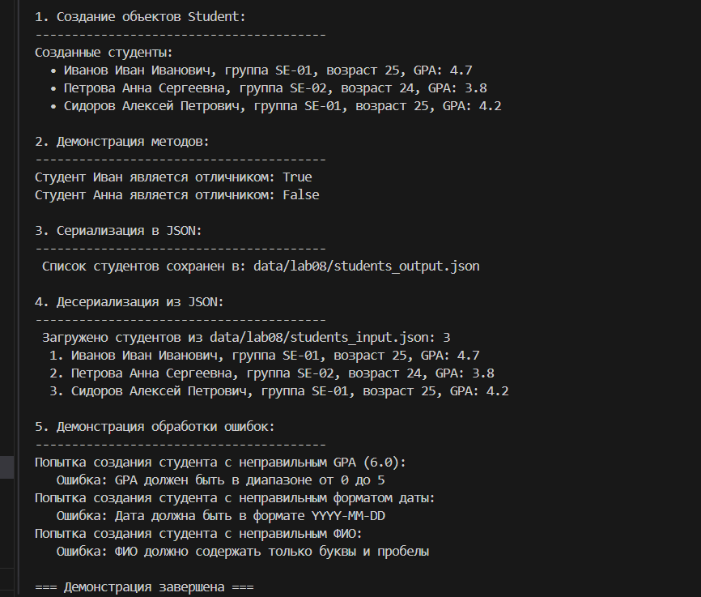

# lab7
## Задание1
### test_text.py
```python
import pytest
import sys
import os

# Прямо указываем путь к файлу
sys.path.insert(0, os.path.abspath(os.path.dirname(__file__) + "/../src"))

# Импортируем напрямую
import importlib.util

spec = importlib.util.spec_from_file_location("text", "src/lib/text.py")
text_module = importlib.util.module_from_spec(spec)
spec.loader.exec_module(text_module)
normalize = text_module.normalize
tokenize = text_module.tokenize
count_freq = text_module.count_freq
top_n = text_module.top_n


def test_normalize():
    assert normalize("ПрИвЕт МИР") == "привет мир"
    assert normalize("  много   пробелов  ") == "много пробелов"
    assert normalize("") == ""


def test_tokenize():
    assert tokenize("привет мир") == ["привет", "мир"]
    assert tokenize("один, два. три!") == ["один", "два", "три"]
    assert tokenize("") == []


def test_count_freq():
    tokens = ["яблоко", "банан", "яблоко"]
    result = count_freq(tokens)
    assert result == {"яблоко": 2, "банан": 1}


def test_top_n():
    freq = {"a": 5, "b": 3, "c": 8, "d": 1}
    result = top_n(freq, 2)
    assert result == [("c", 8), ("a", 5)]


def test_top_n_tie():
    freq = {"z": 3, "a": 3, "b": 3}
    result = top_n(freq, 3)
    assert result == [("a", 3), ("b", 3), ("z", 3)]
```
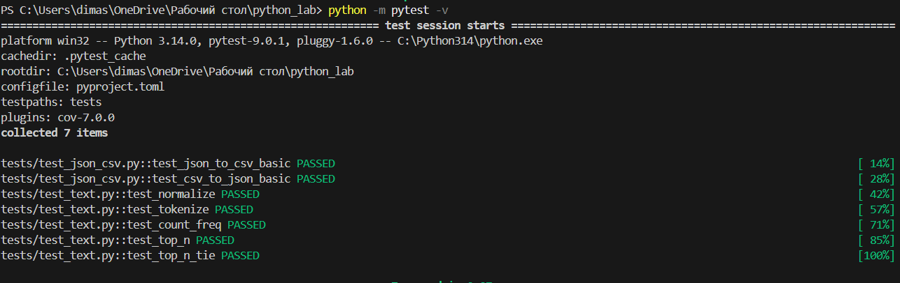
## Задание2
### test_json_csv.py
```python
import pytest
import json
import csv
from pathlib import Path
import sys
import os

# Добавляем src в путь
sys.path.insert(0, os.path.join(os.path.dirname(__file__), "..", "src"))

# Простой импорт
from lab05.json_csv import json_to_csv, csv_to_json


def test_json_to_csv_basic(tmp_path):
    src = tmp_path / "test.json"
    dst = tmp_path / "test.csv"

    data = [{"name": "Alice", "age": 25}, {"name": "Bob", "age": 30}]
    src.write_text(json.dumps(data), encoding="utf-8")

    json_to_csv(str(src), str(dst))

    with open(dst, "r", encoding="utf-8") as f:
        rows = list(csv.DictReader(f))

    assert len(rows) == 2
    assert rows[0]["name"] == "Alice"


def test_csv_to_json_basic(tmp_path):
    src = tmp_path / "test.csv"
    dst = tmp_path / "test.json"

    with open(src, "w", encoding="utf-8", newline="") as f:
        writer = csv.DictWriter(f, fieldnames=["name", "age"])
        writer.writeheader()
        writer.writerow({"name": "Alice", "age": "25"})

    csv_to_json(str(src), str(dst))

    with open(dst, "r", encoding="utf-8") as f:
        data = json.load(f)

    assert len(data) == 1
    assert data[0]["name"] == "Alice"
```
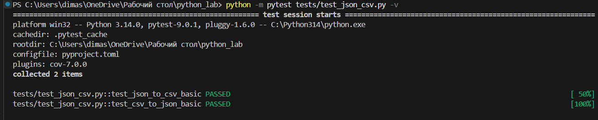
### Black
```python
[build-system]
requires = ["setuptools>=45.0", "wheel"]
build-backend = "setuptools.build_meta"

[tool.black]
line-length = 88

[tool.pytest.ini_options]
testpaths = ["tests"]
```
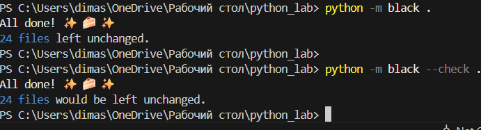

# lab6
## Задание1
### cli_text.py
```python
import argparse
import sys
import os
sys.path.insert(0, os.path.dirname(os.path.dirname(os.path.abspath(__file__))))
try:
    from src.lib.text import *
except ImportError:
# Если импорт не работает, определяем функции прямо здесь
    import re
    from collections import Counter
    
    def normalize(text):
        return text.lower()
    
    def tokenize(text):
        words = re.findall(r'\b\w+\b', text)
        return words
    
    def count_freq(words):
        return Counter(words)
    
    def top_n(word_counts, n=5):
        return word_counts.most_common(n)

def cat(text, n):
    file = open(text, "r").readlines()
    if not n:
        for i in file:
            print(i.replace("\n", ""))
    else:
        file = enumerate(file)
        for i in file:
            print(i[0], i[1].replace("\n", ""))

def stats(txt, n):
    file = open(txt, "r").read()
    txt = top_n(count_freq(tokenize(normalize(file))), n)
    for a in txt:
        print(a[1], a[0])

parser = argparse.ArgumentParser("CLI‑утилиты лабораторной №6")
subparsers = parser.add_subparsers(dest="command")

cat_parser = subparsers.add_parser("cat", help="Вывести содержимое файла")
cat_parser.add_argument("--input", required=True)
cat_parser.add_argument("-n", action="store_true", help="Нумировать строки")

stats_parser = subparsers.add_parser("stats", help="Частоты слез")
stats_parser.add_argument("--input", required=True)
stats_parser.add_argument("--top", type=int, default=5)

args = parser.parse_args()

if args.command == "cat":
    cat(args.input, args.n)

if args.command == "stats":
    stats(args.input, args.top)
```
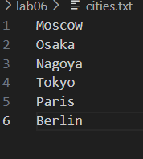
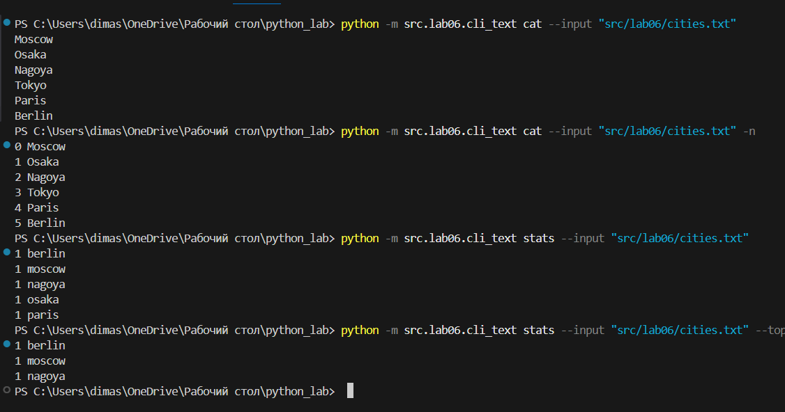

## Задание2
### cli_convert.py
```python
import argparse
import sys
import os
# Получаем абсолютный путь к корню проекта
current_dir = os.path.dirname(os.path.abspath(__file__))
project_root = os.path.dirname(os.path.dirname(current_dir))
sys.path.insert(0, project_root)

try:
    from src.lab05.lab05_csv_xlsx import csv_to_xlsx
    from src.lab05.lab05_json_csv import json_to_csv, csv_to_json
except ImportError as e:
    print(f"Ошибка импорта: {e}")
    print("Убедитесь, что файлы lab05_csv_xlsx.py и lab05_json_csv.py существуют в src/lab05/")
    sys.exit(1)

parser = argparse.ArgumentParser("CLI‑утилиты лабораторной №6")
subparsers = parser.add_subparsers(dest="command")

json2csv_parser = subparsers.add_parser("json2csv", help="Перевести json в csv")
json2csv_parser.add_argument("--in", required=True, dest='input')
json2csv_parser.add_argument("--out", required=True)

csv2json_parser = subparsers.add_parser("csv2json", help="Перевести csv в json")
csv2json_parser.add_argument("--in", required=True, dest='input')
csv2json_parser.add_argument("--out", required=True)

csv2xlsx_parser = subparsers.add_parser("csv2xlsx", help="Перевести csv в xlsx")
csv2xlsx_parser.add_argument("--in", required=True, dest='input')
csv2xlsx_parser.add_argument("--out", required=True)

args = parser.parse_args()

if args.command == "json2csv":
    json_to_csv(args.input, args.out)

if args.command == "csv2json":
    csv_to_json(args.input, args.out)

if args.command == "csv2xlsx":
    csv_to_xlsx(args.input, args.out)
```
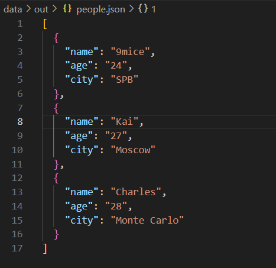

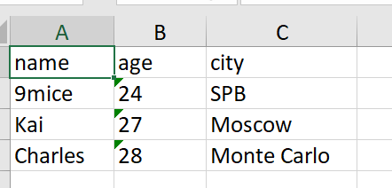
# lab5
## Задание1
### json_csv.py
```python
import json
import csv
from pathlib import Path


def json_to_csv(json_path: str, csv_path: str) -> None:
    
    json_path = Path(json_path)
    csv_path = Path(csv_path)
    
   
    if not json_path.exists():
        raise FileNotFoundError(f"JSON файл не найден: {json_path}")
    
    
    try:
        with json_path.open('r', encoding='utf-8') as json_file:
            data = json.load(json_file)
    except json.JSONDecodeError as e:
        raise ValueError(f"Ошибка декодирования JSON: {e}")
    
   
    if not data:
        raise ValueError("Пустой JSON или неподдерживаемая структура")
    
    if not isinstance(data, list):
        raise ValueError("JSON должен содержать список объектов")
    
    if not all(isinstance(item, dict) for item in data):
        raise ValueError("Все элементы JSON должны быть словарями")
    
    if len(data) == 0:
        raise ValueError("Пустой список в JSON")
    
    
    all_fields = set()
    for item in data:
        all_fields.update(item.keys())
    fieldnames = sorted(all_fields)
    

    try:
        with csv_path.open('w', newline='', encoding='utf-8') as csv_file:
            writer = csv.DictWriter(csv_file, fieldnames=fieldnames)
            writer.writeheader()
            
            for item in data:
                
                row = {field: item.get(field, '') for field in fieldnames}
                writer.writerow(row)
                
    except Exception as e:
        raise ValueError(f"Ошибка записи CSV: {e}")


def csv_to_json(csv_path: str, json_path: str) -> None:
    
    csv_path = Path(csv_path)
    json_path = Path(json_path)
    
   
    if not csv_path.exists():
        raise FileNotFoundError(f"CSV файл не найден: {csv_path}")
    
   
    try:
        with csv_path.open('r', encoding='utf-8') as csv_file:
            
            sample = csv_file.read(1024)
            csv_file.seek(0)
            
            sniffer = csv.Sniffer()
            dialect = sniffer.sniff(sample)
            has_header = sniffer.has_header(sample)
            
            if not has_header:
                raise ValueError("CSV файл должен содержать заголовок")
            
            reader = csv.DictReader(csv_file, dialect=dialect)
            rows = list(reader)
            
    except Exception as e:
        raise ValueError(f"Ошибка чтения CSV: {e}")
    
  
    if not rows:
        raise ValueError("Пустой CSV файл")
    

    try:
        with json_path.open('w', encoding='utf-8') as json_file:
            json.dump(rows, json_file, ensure_ascii=False, indent=2)
            
    except Exception as e:
        raise ValueError(f"Ошибка записи JSON: {e}")
        
```
## Задание2
### csv_xlsx.py
```python
import csv
from pathlib import Path
from openpyxl import Workbook
from openpyxl.utils import get_column_letter


def csv_to_xlsx(csv_path: str, xlsx_path: str) -> None:
    
    csv_path = Path(csv_path)
    xlsx_path = Path(xlsx_path)
    
    
    if not csv_path.exists():
        raise FileNotFoundError(f"CSV файл не найден: {csv_path}")
   
    try:
        with csv_path.open('r', encoding='utf-8') as csv_file:
           
            sample = csv_file.read(1024)
            csv_file.seek(0)
            
            sniffer = csv.Sniffer()
            dialect = sniffer.sniff(sample)
            has_header = sniffer.has_header(sample)
            
            if not has_header:
                raise ValueError("CSV файл должен содержать заголовок")
            
            reader = csv.reader(csv_file, dialect=dialect)
            rows = list(reader)
            
    except Exception as e:
        raise ValueError(f"Ошибка чтения CSV: {e}")
    
    
    if not rows:
        raise ValueError("Пустой CSV файл")
    
    try:
        wb = Workbook()
        ws = wb.active
        ws.title = "Sheet1"
        
     
        for row in rows:
            ws.append(row)
        
       
        for col_idx, _ in enumerate(rows[0], 1):
            column_letter = get_column_letter(col_idx)
            max_length = 0
            
            for row_idx, row in enumerate(rows, 1):
                cell_value = str(row[col_idx - 1]) if len(row) >= col_idx else ""
                max_length = max(max_length, len(cell_value))
            
            
            adjusted_width = max(max_length + 2, 8)
            ws.column_dimensions[column_letter].width = adjusted_width
        
        
        wb.save(str(xlsx_path))
        
    except Exception as e:
        raise ValueError(f"Ошибка создания XLSX: {e}")
```
### test.py
```python
import sys
import os
from pathlib import Path

# Добавляем корневую директорию проекта в Python path
project_root = Path(__file__).parent.parent.parent
sys.path.insert(0, str(project_root))

from src.lab05.json_csv import json_to_csv, csv_to_json
from src.lab05.csv_xlsx import csv_to_xlsx


def main():
    """Основная функция тестирования"""
    print("=== Тестирование Lab05: Конвертации JSON, CSV, XLSX ===\n")
    
    # Создаем директорию для выходных файлов
    out_dir = Path('data/out')
    out_dir.mkdir(parents=True, exist_ok=True)
    
    try:
        # 1. JSON → CSV
        print("1. Конвертация JSON → CSV")
        json_to_csv('data/samples/people.json', 'data/out/people_from_json.csv')
        print("   ✓ Успешно: data/out/people_from_json.csv")
        
        # 2. CSV → JSON
        print("2. Конвертация CSV → JSON")
        csv_to_json('data/samples/people.csv', 'data/out/people_from_csv.json')
        print("   ✓ Успешно: data/out/people_from_csv.json")
        
        # 3. CSV → XLSX 
        print("3. Конвертация CSV → XLSX (people)")
        csv_to_xlsx('data/samples/people.csv', 'data/out/people.xlsx')
        print("   ✓ Успешно: data/out/people.xlsx")
        
        # 4. CSV → XLSX 
        print("4. Конвертация CSV → XLSX (cities)")
        csv_to_xlsx('data/samples/cities.csv', 'data/out/cities.xlsx')
        print("   ✓ Успешно: data/out/cities.xlsx")
        
        # 5. Обратная конвертация для проверки обратимости
        print("5. Проверка обратимости JSON ↔ CSV")
        csv_to_json('data/out/people_from_json.csv', 'data/out/people_roundtrip.json')
        json_to_csv('data/out/people_from_csv.json', 'data/out/people_roundtrip.csv')
        print("   ✓ Успешно: выполнены обратные конвертации")
        
        print("\n=== Все операции завершены успешно! ===")
        print("\nСозданные файлы:")
        for file in out_dir.glob('*'):
            print(f"  - {file}")
            
    except Exception as e:
        print(f"\n Ошибка: {e}")
        import traceback
        traceback.print_exc()
        return 1
    
    return 0


if __name__ == "__main__":
    sys.exit(main())
```
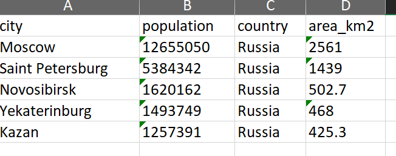
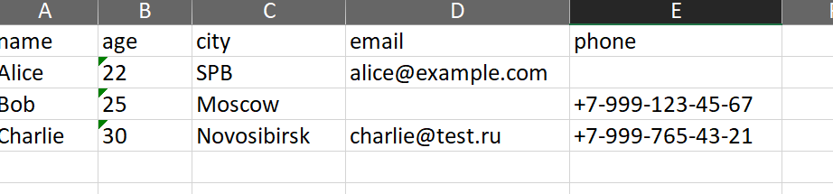
# lab4
## Задание1
### io_txt_csv.py
```python
import csv
from pathlib import Path

def read_text(path: str | Path, encoding: str = "utf-8") -> str:
    with open(path, 'r', encoding=encoding) as file:
        return file.read()

def write_csv(rows: list[tuple | list], path: str | Path, header: tuple[str, ...] | None = None) -> None:
    if rows:
        first_len = len(rows[0])
        for i, row in enumerate(rows):
            if len(row) != first_len:
                raise ValueError(f"Строка {i} имеет длину {len(row)}, ожидается {first_len}")
    ensure_parent_dir(path)
    with open(path, 'w', newline='', encoding='utf-8') as file:
        writer = csv.writer(file)
        if header is not None:
            writer.writerow(header)
        writer.writerows(rows)

def ensure_parent_dir(path: str | Path) -> None:
    Path(path).parent.mkdir(parents=True, exist_ok=True)
```
## Задание2
### text_report.py
```python
import re
import argparse
from pathlib import Path
from io_txt_csv import read_text, write_csv

def normalize(text: str, *, casefold: bool = True, yo2e: bool = True) -> str:
    if casefold:
         text = text.casefold()
    else: text
    if yo2e:
        text = text.replace('ё','е').replace('Ё','Е') 
    else: text
    text = text.strip()
    text = re.sub(r'[\t\r\x00-\x1f\x7F]', ' ', text) 
    text = ' '.join(text.split())
    return text

def tokenize(text: str) -> list[str]:
    pattern = r'\w+(?:-\w+)*'
    tokens  = re.findall(pattern, text)
    return tokens

def count_freq(tokens: list[str]) -> dict[str, int]:
    unique_words = list(set(tokens))
    list_count = [tokens.count(i) for i in unique_words]
    dict_count = {key: word for key, word in list(zip(unique_words, list_count))}
    return dict_count

def top_n(freq: dict[str, int], n: int = 5) -> list[tuple[str, int]]:
    list_dict = list(freq.items())
    top = sorted(list_dict, key=lambda x:  x[0])
    top_plus = sorted(top, key=lambda x: x[1], reverse=True)[:n]
    return top_plus

def main():
    parser = argparse.ArgumentParser(description='Анализ текста и создание отчета')
    parser.add_argument('--in', dest='input_file', default='data/lab04/input.txt',
                       help='Входной текстовый файл (по умолчанию: data/lab04/input.txt)')
    parser.add_argument('--out', dest='output_file', default='data/lab04/report.csv',
                       help='Выходной CSV файл (по умолчанию: data/lab04/report.csv)')
    parser.add_argument('--encoding', default='utf-8',
                       help='Кодировка файла (по умолчанию: utf-8, для Windows: cp1251)')
    args = parser.parse_args()
    
    try:
        print(f"Чтение файла: {args.input_file}")
        text = read_text(args.input_file, encoding=args.encoding)
        print("Анализ текста...")
        normalized = normalize(text)
        tokens = tokenize(normalized)
        word_counts = count_freq(tokens)
        sorted_words = sorted(word_counts.items(), 
                             key=lambda x: (-x[1], x[0]))
        print(f"Сохранение отчета: {args.output_file}")
        rows = [(word, count) for word, count in sorted_words]
        header = ("word", "count")
        write_csv(rows, args.output_file, header)
        print("\n--- ОТЧЕТ ---")
        print(f"Всего слов: {len(tokens)}")
        print(f"Уникальных слов: {len(word_counts)}")
        print("Топ-5:")
        freq = count_freq(tokens)
        top_words = top_n(freq, 5)
        for word, count in top_words:
            print(f"{word}:{count}")
        print(f"\nОтчет сохранен в: {args.output_file}")
        
    except FileNotFoundError:
        return 'FileNotFoundError'
    except UnicodeDecodeError:
        return 'UnicodeDecodeError'
    except Exception:
        return 'Exception'

if __name__ == "__main__":
    main()
```
## Тест‑кейсы
### 1


### 2


### 3


# lab3
## Задание1
### text.py
```python
import re
from enum import unique


def normalize(text: str, *, casefold: bool = True, yo2e: bool = True) -> str:
    if casefold:
        text = text.casefold()
    if yo2e:
        text = text.replace('ё', 'е')
        text = text.replace('Ё', 'Е')
        text = text.replace('\n', ' ').replace('\r', ' ').replace('\t', ' ')
    while '   ' in text:
        text = text.replace('   ', ' ')
    return text.strip()


def tokenize(text: str) -> list[str]:
    text = text.replace('!', '')
    text = re.split(r'[^\w-]+', text)
    return text


def count_freq(tokens: list[str]) -> dict[str, int]:
    dic = {}
    unique = set(tokens)
    for _ in unique:
        dic[_] = tokens.count(_)
    return dict(sorted(dic.items(), key=lambda x: (-x[1], x[0])))


def top_n(freq: dict[str, int], n: int = 5) -> list[tuple[str, int]]:
    return sorted(freq.items(), key=lambda x: x[1], reverse=True)[:n]


print('----------normalize----------')
print(normalize("ПрИвЕт\nМИр\t"))
print(normalize("ёжик, Ёлка"))
print(normalize("Hello\r\nWorld"))
print(normalize("  двойные   пробелы  "))
print('----------tokenize----------')
print(tokenize("привет мир"))
print(tokenize("hello,world!!!"))
print(tokenize("по-настоящему круто"))
print(tokenize("2025 год"))
print(tokenize("emoji 😀 не слово"))
print('----------count_freq + top_n----------')
print(count_freq(["a","b","a","c","b","a"]))
print(count_freq(["bb","aa","bb","aa","cc"]))
print(top_n({"a":3,"b":2,"c":1}, n=2))
print(top_n({"aa":2,"bb":2,"cc":1}, n=2))
```

## Задание2
### text_stats.py
```python
import sys
import os

sys.path.append('/Users\dimas\OneDrive\Рабочий стол\python_lab-1\src\lib') 
from text import *

text = input()
tokens = []
def main():
    if not text:
        print("Ввод не предоставлен")
        return
    normalized_text = normalize(text)

for word in normalize(text).split():
    clean_word = word.strip('.,!!!!?;:"()[]{}')
    if clean_word:
        tokens.append(clean_word)

total_words = len(tokens)
freq_dict = count_freq(tokens)
unique_words = len(freq_dict)
top_words = top_n(freq_dict, 5)
print(f"Всего слов: {total_words}")
print(f"Уникальных слов: {unique_words}")
print("Топ-5:")
for word, count in top_words:
        print(f"{word}:{count}")

main()
```

# lab2
### Задание1
### 1 arrays.py (min_max)
```python
def min_max(mns_mxs):
    if len(mns_mxs) != 0:
        return print (tuple([min(mns_mxs), max(mns_mxs)]))
    else:
        raise ValueError
min_max([3, -1, 5, 5, 0])
min_max([42])
min_max([-5, -2, -9])
min_max([])
min_max([1.5, 2, 2.0, -3.1])
```

### 2 arrays.py (unique_sorted)
```python
def unique_sorted(elements):
    elements = list(set(sorted(elements)))
    elements.sort(reverse=False)
    return elements
print(unique_sorted([3, 1, 2, 1, 3]))
print(unique_sorted([]))
print(unique_sorted([-1, -1, 0, 2, 2]))
print(unique_sorted([1.0, 1, 2.5, 2.5, 0]))
```

### 3 arrays.py (flatten)
```python
def flatten(flatten_elem):
    result_sort = []
    for i in range(len(flatten_elem)):
        if type(flatten_elem[i]) in [list, tuple]:
            result_sort += list(flatten_elem[i])
        else:
            raise TypeError
    return result_sort
print(flatten([[1, 2], [3, 4]]))
print(flatten([[1, 2], (3, 4, 5)]))
print(flatten([[1], [], [2, 3]]))
print(flatten([[1, 2], "ab"]))
```

### Задание2
### 1 matrix.py(transpose)
```python
def transpose(matrix):
    if not matrix:
        return []
    
    for el_mat in matrix:
        if len(el_mat)!=len(matrix[0]):
            raise ValueError
        
    result=[]
    for i in range(len(matrix[0])):
        transposes=[]
        for j in range(len(matrix)):
            transposes.append(matrix[j][i])
        result.append(transposes)
    return result
print('transpose')
print(transpose([[1, 2, 3]]))
print(transpose([[1], [2], [3]]))
print(transpose([[1, 2], [3, 4]]))
print(transpose([]))
print(transpose([[1, 2], [3]]))
```

### 2 matrix.py(row_sums)
```python
def row_sums(sum_matrix):
    if not sum_matrix:
        return []
    
    for el_mat in sum_matrix:
        if len(el_mat)!=len(sum_matrix[0]):
            raise ValueError
    
    summa=[]
    for el_mat in sum_matrix:
        el_sum = sum(el_mat)
        summa.append(el_sum)
    return summa
print('row_sums')
print(row_sums([[1, 2, 3], [4, 5, 6]]))
print(row_sums([[-1, 1], [10, -10]]))
print(row_sums([[0, 0], [0, 0]]))
print(row_sums([[1, 2], [3]]))
```

### 3 matrix.py(col_sums)
```python
def col_sums(col_matrix):
    if not col_matrix:
        return []
    
    for el_mat in col_matrix:
        if len(el_mat)!=len(col_matrix[0]):
            raise ValueError
    result=[]
    for i in range(len(col_matrix[0])):
        summ=0
        for j in range(len(col_matrix)):
            summ+=col_matrix[j][i]
        result.append(summ)
    return result
print('col_sums')
print(col_sums([[1, 2, 3], [4, 5, 6]]))
print(col_sums([[-1, 1], [10, -10]]))
print(col_sums([[0, 0], [0, 0]]))
print(col_sums([[1, 2], [3]]))


```

### Задание3
### tuples.py
```python
def format(tuple_inf):
    if len(tuple_inf)!=3:
        raise TypeError
    if type(tuple_inf[2])!=float:
        raise TypeError
    if type(tuple_inf[0])!=str:
        raise TypeError
    if type(tuple_inf[1])!=str:
        raise TypeError
    fio=tuple_inf[0].strip().split()
    gruppa=tuple_inf[1].strip()
    gpa=tuple_inf[2]
    fio_out=fio[0].capitalize()+' '
    if not fio:
        raise ValueError
    if not gruppa:
        raise ValueError
    if gpa<0:
        raise ValueError
    for i in range(1,len(fio)):
        fio_out+=fio[i][0].upper()+'.'
    print(fio_out+','+ f' гр. {tuple_inf[1]}',f'GPA {tuple_inf[2]:.2f}')
format(('Иванов Иван Иванович','BIVT-25',4.6))
format(("Петров Пётр", "IKBO-12", 5.0))
format(("Петров Пётр Петрович", "IKBO-12", 5.0))
format(("  сидорова  анна   сергеевна ", "ABB-01", 3.999))
```


# lab1
### Задание 1
```python
name = input("Имя: ")
age = input("Возраст: ")
print("Првиет, " + name + "!", "Через год тебе будет " + str(int(age)+1) + ".")
```


### Задание 2
```python
a = input()
b = float(input())
print("a: " + a.replace('.', ','))
print("b: " + str(b))
print("sum=" + f"{(float(a)+b):.2f}" + ";" + " avg=" + f"{(float(a)+b)/2:.2f}")
```


### Задание 3
```python
price=float(input())
discount=float(input())
vat=float(input())
base=price*(1-discount/100)
vat_amount=base*(vat/100)
total=base+vat_amount
print(f'База после скидки:{base:.2f}₽')
print(f'НДС:{vat_amount:.2f}₽')
print(f'Итого к оплате:{total:.2f}₽')
```


### Задание 4
```python
m = int(input("Минуты: "))
print(str(m//60) + ":" + f"{(m%60):02d}")
```


### Задание 5
```python
a, b, c = map(str, input().split())
print("ФИО: ", a, b, c)
print("Инициалы: ", a[0] + b[0] + c[0] + '.')
print("Длина (символов): " + str(len(a) + len(b) + len(c) + 2))
```

